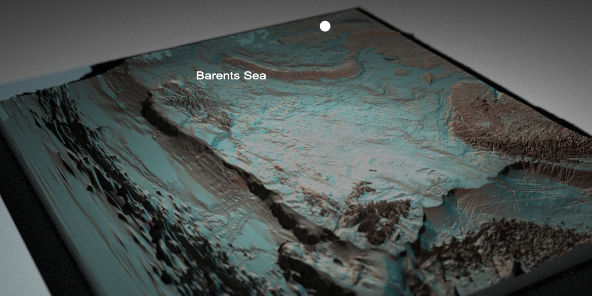

```{css, echo = FALSE}

.nav {
  border-width: 0 0px 0px 0px;
  font-weight: normal;
  test-transform: ;
}

.nav-pills>li>a {
  color: #000000;
  background-color: #fffff ;
  border-color: #faeb00;
}

.nav-pills>li.active>a {
  color: #000000;
  background-color: #faeb00 ;
  border-color: #000000;
}

.nav-pills>li.active>a:focus {
  color: #000000;
  background-color: #faeb00 ;
  border-color: #000000;
}
```

```{r, include = FALSE}
knitr::opts_chunk$set(
  collapse = TRUE,
  comment = "#>"
)
library(tidyverse) 

```



# MiMeMo.BarentsSea

This page details at a broad level the code written to extract data and parameterise StrathE2E*Polar* as part of MiMeMo. You can find information on the depedencies, runtimes, and tasks performed by each of the scripts. Scripts are loosely classified into families -*bathymetry*-*fish*-*flows*-*nemo-medusa*-*saltless*-*StrathE2E*. These can all be run from a master script, with a region file allowing the user to define the model domain for data extraction.

## Script Objectives {.tabset .tabset-fade .tabset-pills}

In the future I plan to detail blow by blow what exactly each script does. This will likely take the form of a dropdown list of vignettes on this website. As there are about 40 scripts at the moment this isn't going to happen immediately. For now this section is here to briefly mention the purpose of each script.
 
### bathymetry

| Script | Purpose                                        |
|-----------------|---------------------------------------|
| 1 DATA WRANGLING|   |
| 2 PLOTTING      |   |
| 3 RAYSHADER     |   |
| 4 DOMAIN CHOICES|   |
| 5 DEFINE DOMAIN |   |

### fish

| Script | Purpose                                        |
|-----------------|---------------------------------------|
|1 FAO REGIONS||
|2 SUMMARIES AND PLOTTING||
|3 DATA WRANGLING||
|4 PLOTTING||

### flows

| Script | Purpose                                        |
|-----------------|---------------------------------------|
|1 VC-EXTRACTION||
|2 MAKE TRANSECTS||
|3 LABEL TRANSECTS||
|4 SAMPLE PERIMETER||
|5 SAMPLE FLUXES||
|6 VOLUME CHECK||
|7 PLOT EXCHANGES||

### nemo-medusa

| Script | Purpose                                        |
|-----------------|---------------------------------------|
|1 GRID||
|2 EXTRACTION||
|3 SPATIAL||
|4 TIME SERIES||
|5 PLOTTING|||
|6 LIGHT AND TEMP||

### saltless

| Script | Purpose                                        |
|-----------------|---------------------------------------|
|2 COMPILE DRIVING DATA||
|3 COMPILE PHYSICAL PARAMETERS||

### StrathE2E

| Script | Purpose                                        |
|-----------------|---------------------------------------|
|2 COMPILE DRIVING DATA||
|3 COMPILE PHYSICAL PARAMETERS||

## Script Relations

```{r code relations, echo = FALSE, eval = TRUE, message = FALSE, warning= FALSE, out.width ="100%", fig.asp = 1, dpi = 800}


## Automatically trawl my R scripts to find objects being written and read, 
## and then connect these scripts for a network graph

library(tidyverse)                                                         # Enter the tidyverse
library(igraph)
library(ggraph)

Scripts <- list.files("./R scripts",  pattern = ".R", recursive = T, full.names = T) %>%  # Read in all the Rscripts 
  as.data.frame() %>% 
  filter(!grepl('@|X_|Z_|rayshader|targets|R-chive', .)) %>%                       # Ignore files labelled in these ways
  mutate(Script = as.character(.)) %>%                                    
  select(-.)

Links <- function(script) {
  
  #script <- Scripts[16,1]                                                  # Testing
  example <- readLines(script)                                              # Get each line in a script as a character vector
  
  imports <- grepl("readRDS\\(", example)                                   # Which lines use readRDS
  exports <- grepl("saveRDS\\(", example)                                   # Which lines use saveRDS
  functions <- grepl("source\\(", example)                                  # Does the script call a function file?
  
  From <- example[exports] %>%                                              # Which objects come from this script
    data.frame(Object = .) %>%                                              # A column of objects being saved
    mutate(Object = as.character(Object),                                   
           From = script) %>%                                               # Attach the script name
    separate(From, into = c(NA, "From"), sep = "./R scripts/") %>%          # Shrink the script name
    separate(Object, into = c(NA, "Object"), sep = "[.]")                   # Isolate the object name between ". and )"
  
  To <- example[imports] %>%                                                # Which objects are read into this script
    data.frame(Object = .) %>%                                              
    mutate(Object = as.character(Object),
           To = script) %>% 
    separate(To, into = c(NA, "To"), sep = "./R scripts/") %>%              # Shrink the script name
    separate(Object, into = c(NA, "Object"), sep = "[.]")                   # Isolate the file name between ". and )"
  
  Functions <- example[functions] %>% 
    data.frame(From = .) %>% 
    filter(!grepl('Region file', .)) %>%                                    # Ignore files labelled in these ways
    mutate(From = as.character(From),
           To = script) %>% 
    separate(From, into = c(NA, "From"), sep = "./R scripts/") %>%          # Shrink the script name
    separate(To, into = c(NA, "To"), sep = "./R scripts/") %>%              # Shrink the script name
    separate(From, into = c("From", NA), sep = " ") %>%                     # Shrink the script name
    mutate(From = paste(From, "FUNCTIONS.R"))
  
  Links <- bind_rows(From, To) %>% 
    bind_rows(Functions)
  
  return(Links)  
}    # Function to return the files read and saved by a script, and any function files called

#### Establish the relations file ####

Scripts2 <- filter(Scripts, !grepl('FUNCTIONS', Scripts$Script))          # Ignore functions files as relationships aren't object mediated (but keep Scripts for defining nodes later)

all <- map(Scripts2[,1], Links) %>%                                       # Check for links in all R scripts
  bind_rows()

From <- select(all, -To) %>%                                              # Grab just the files creating objects
  drop_na() 

To <- select(all, -From) %>%                                              # Grab just the files reading in objects
  drop_na()

#### Format for a network graph ####

nodes <- data.frame(id = seq(1:length(unique(Scripts$Script))),
                    label = as.character(unique(Scripts$Script))) %>% 
  separate(label, into = c(NA, "label"), sep = "./R scripts/")

Edges <- full_join(From, To) %>%                                          # Join Tos and Froms by the shared object 
  drop_na() %>%                        
  bind_rows(filter(all, is.na(Object)))  %>%                              # Add in the relationships to functions files, which aren't mediated by an object
  distinct() %>%                                                          # Remove any repeated links
  left_join(nodes, by = c("From" = "label")) %>%                          # add in numerical code for scripts
  select(-From, from = id) %>%                                            # relabel
  left_join(nodes, by = c("To" = "label")) %>%                            # repeat relabelling for to column
  select(-To, to = id) %>% 
  mutate(arrows = "middle") %>%                                           # Add arrows in the middle of the edge when plotting
  select(from, to, arrows, Object) %>% 
  drop_na()
  
nodes <- separate(nodes, label, into = c("group", NA), remove = F, sep = "[.]") %>% # Add a group field for colour
  mutate(color = case_when(group == "bathymetry/bathymetry" ~ "#ff8000",
                           group == "fish/fish" ~ "#00ffff",
                           group == "flows/flows" ~ "#0993de",    
                           group == "nm/nemo-medusa" ~ "#ffffff",       
                           group == "saltless/saltless" ~ "#ffea09",   
                           group == "se2e/strathE2E" ~ "#aba6a6")) %>%
  mutate(label = str_remove(label, paste0(group, "."))) %>%
  separate(group, into = c(NA, "group"))

#### Format for hierarchical edge bundling ####

# create a data frame giving the hierarchical structure of your individuals. 
# Origin on top, then groups, then subgroups
d1 <- data.frame(from="origin", to= unique(nodes$group))
d2 <- data.frame(from=nodes$group, to=nodes$label)
hierarchy <- rbind(d1, d2)

# create a vertices data.frame. One line per object of our hierarchy, giving features of nodes.
vertices <- data.frame(name = unique(c(as.character(hierarchy$from), as.character(hierarchy$to))) ) 
vertices$group  <-  hierarchy$from[ match( vertices$name, hierarchy$to ) ]
from <- match(nodes$label[Edges$from], vertices$name)
to <- match(nodes$label[Edges$to], vertices$name)

#calculate label angle
vertices$id <- NA
myleaves <- which(is.na(match(vertices$name, Edges$from) ))
nleaves <- length(myleaves)
vertices$id[ myleaves ] <- seq(1:nleaves)-7                                                      # - 7 for the nodes not plotted (origin and each family level)
vertices$angle <- 0 - 360 * (vertices$id+4) / (nleaves-7)

vertices$hjust <- ifelse(between(vertices$angle, -270, -90), 1, 0)                               # Make sure labels are justified outwards
vertices$angle <- ifelse(between(vertices$angle, -270, -90), vertices$angle+180, vertices$angle) # Flip labels if they are upside down

mygraph <- graph_from_data_frame(hierarchy, vertices = vertices)                                 # Create the network 

## plot
ggraph(mygraph, layout = 'dendrogram', circular = TRUE) + 
  theme_void() +
  geom_conn_bundle(data = get_con(from = from, to = to), width=1, alpha=0.6, aes(colour=..index..), 
                   tension = 0.3, show.legend = F) +
  scale_edge_colour_distiller(palette = "RdBu") +
  theme(legend.position = "bottom") +
  geom_node_point(aes(filter = leaf, x = x*1, y=y*1, fill=group), 
                  colour = "black", shape = 21, size=3) +
  geom_node_text(aes(x = x*1.1, y=y*1.1, filter = leaf, label=name, angle = angle, hjust= hjust), 
                 size=1.75, fontface = "bold", alpha=1) +
  scale_colour_manual(values= unique(nodes$color)) +
  scale_fill_manual(values= unique(nodes$color)) +
  labs(fill = NULL) +
  xlim(-1.8, 1.8) +
  ylim(-1.7, 1.7)

```


## Run Times

```{r code runtimes, echo = FALSE, eval = TRUE, message = FALSE, warning= FALSE, out.width ="100%", gif.asp = 1, dpi = 800}

timings <- readRDS("./Objects/All run times.rds")

#### Cool circular bar plot ####

#Create dataset
data <- data.frame(
  individual= timings$Script,
  group= timings$Type,
  value= timings$Minutes) %>% 
  separate(individual, into = c(NA, "individual",NA), sep = "[.]") # Drop leading script family for labelling bars.


# Set a number of 'empty bar' to add at the end of each group
empty_bar <- 3
to_add <- data.frame( matrix(NA, empty_bar*nlevels(data$group), ncol(data)) )
colnames(to_add) <- colnames(data)
to_add$group <- rep(levels(data$group), each=empty_bar)
data <- rbind(data, to_add)
data <- data %>% arrange(group)
data$id <- seq(1, nrow(data))

# Get the name and the y position of each label
label_data <- data
number_of_bar <- nrow(label_data)
angle <- 90 - 360 * (label_data$id-0.5) /number_of_bar     # I substract 0.5 because the letter must have the angle of the center of the bars. Not extreme right(1) or extreme left (0)
label_data$hjust <- ifelse( angle < -90, 1, 0)
label_data$angle <- ifelse(angle < -90, angle+180, angle)

# prepare a data frame for base lines
base_data <- data %>% 
  group_by(group) %>% 
  summarize(start=min(id), end=max(id) - empty_bar) %>% 
  rowwise() %>% 
  mutate(title=mean(c(start, end)))

# Make the plot
ggplot(data, aes(x=as.factor(id), y=value, fill=group)) +       # Note that id is a factor. If x is numeric, there is some space between the first bar
  
  geom_bar(aes(x=as.factor(id), y=value, fill=group), stat="identity", alpha=0.5) +   # Begin plot
  # Add axis marks
  annotate("rect", xmin = 0.5, ymin = 0, xmax = max(data$id) - 0.5, ymax = 60, colour = "white", alpha=0.1, fill = "cornflowerblue") +
  annotate("rect", xmin = 0.5, ymin = 60, xmax = max(data$id) - 0.5, ymax = 120, colour = "white", alpha=0) +
  annotate("rect", xmin = 0.5, ymin = 120, xmax = max(data$id) - 0.5, ymax = 180, colour = "white", alpha=0.1, fill = "cornflowerblue") +
  annotate("rect", xmin = 0.5, ymin = 180, xmax = max(data$id) - 0.5, ymax = 240, colour = "white", alpha=0) +
  annotate("rect", xmin = 0.5, ymin = 240, xmax = max(data$id) - 0.5, ymax = 300, colour = "white", alpha=0.1, fill = "cornflowerblue") +
  # Add text labels for axis marks
  annotate("text", x = rep(max(data$id),6), y = c(0, 60, 120, 180, 240, 300), label = c("0", "1", "2", "3", "4", "5") , color="grey", size=3 , angle=0, fontface="bold", hjust= 0.5) +
  geom_bar(aes(x=as.factor(id), y=value, fill=group), stat="identity") +
  #viridis::scale_fill_viridis(discrete = T, name = NULL) +
  palettetown::scale_fill_poke(pokemon = "Charizard", name = NULL) +
  ylim(-300,400) +        # More - creates more space in the centre, if a bar is larger than max it won't display
  annotate("text", x = max(data$id), y = 350, label = paste0("Total project run time: ", round(sum(data$value, na.rm = T)/60, digits = 2), " hours"),
           size = 3) +
  theme_minimal() +
  theme(legend.position = c(0.5, 0.5),
        axis.text = element_blank(),
        axis.title = element_blank(),
        panel.grid = element_blank(),
        plot.margin = unit(c(-1.8, -2.5,-2.5,-2.5), "cm")
       ) +
  coord_polar() + 
  geom_text(data=label_data, aes(x=id, y=value+10, label=individual, hjust=hjust), color="black", fontface="bold",alpha=0.6, size=2.5, angle= label_data$angle, inherit.aes = FALSE ) +
  # Add base line information
  geom_segment(data=base_data, aes(x = start, y = -5, xend = end, yend = -5), colour = "black", alpha=0.8, size=0.6 , inherit.aes = FALSE )  +
 # labs(caption = paste0("Total project run time: ", round(sum(data$value, na.rm = T)/60, digits = 2), " hours")) +
  NULL

```

