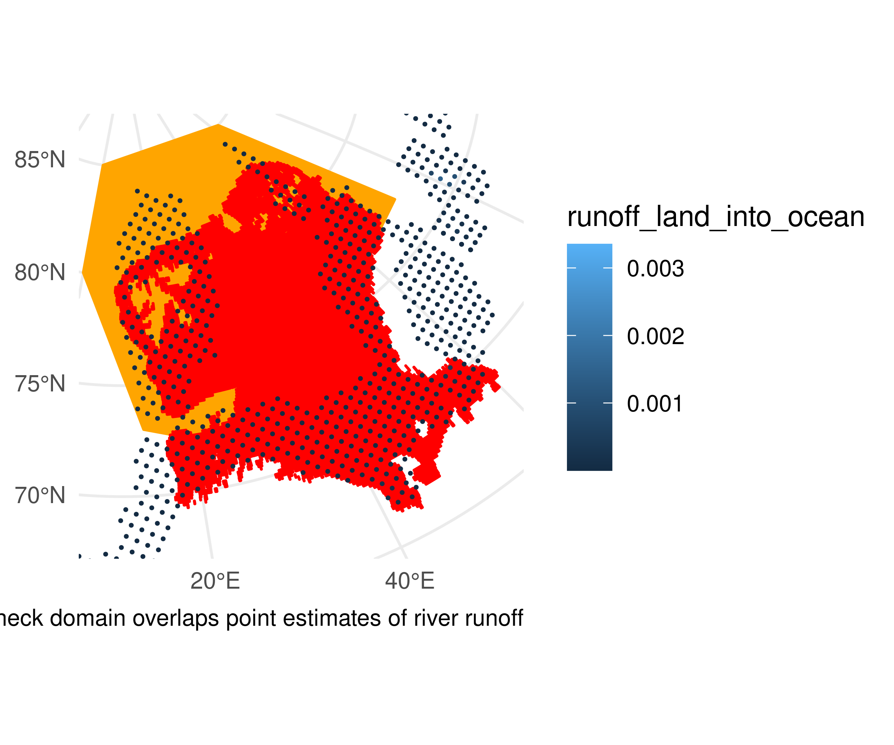
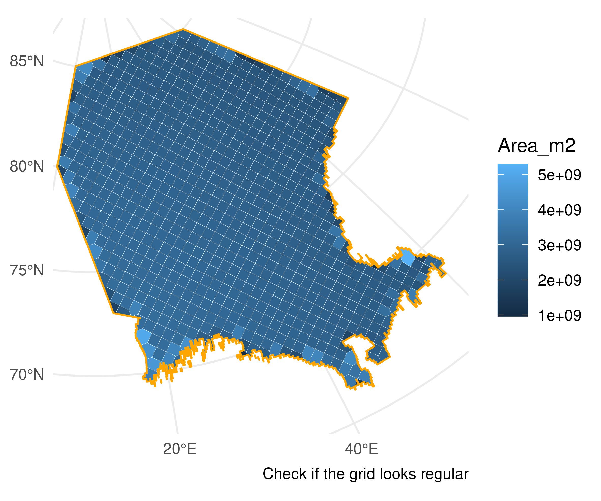
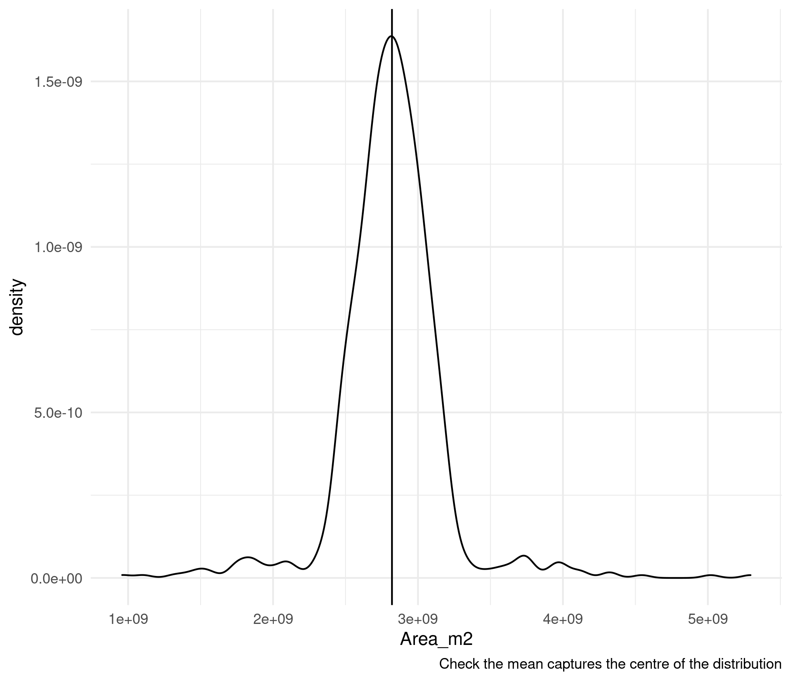
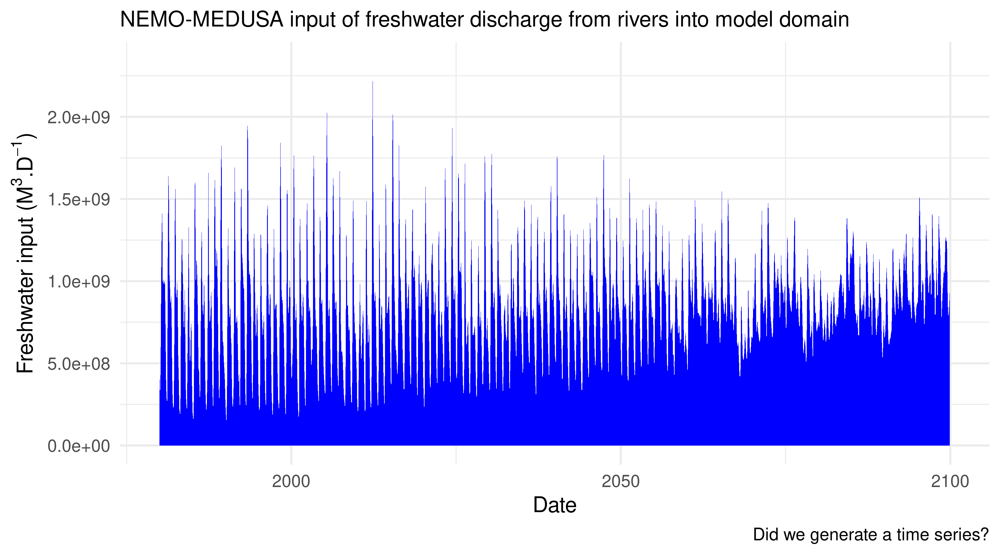

```{r setup, include=FALSE}
knitr::opts_chunk$set(echo = F, fig.align = "center")

library(magrittr)

list.files("../Figures/", pattern = ".check.", recursive = T, full.names = T) %>% # Copy checks into the website directory
  file.copy(overwrite = T, recursive = T, to = "./man/figures/") # Overwrite to ensure tests are updated.

```

<br>

While developing the work-flow to parameterise StrathE2Epolar for MiMeMo, I put in plenty of checks along the way. Just because the code runs error free, it doesn't mean that geographic areas intersect correctly or that the end result isn't just a garbled mess of NAs. 

<br>

## Choose a code family and a script to check {.tabset .tabset-pills .tabset-fade}

### bathymetry {.tabset .tabset-pills .tabset-fade}

#### Script one

<br> <br> <br> <br>

<div class="hi-light"> **Bathymetry scripts are responsible for defining the model domain.** </div>

Script one reduces the resolution of the GEBCO bathymetry to make things tractable.

The only test is to make sure the global bathymetry still looks right. Check things like orientation.

```{r}
plot(pressure)
```

#### Script two

```{r}
plot(pressure)
```

#### Script three

```{r}
plot(pressure)
```

### nemo-medusa {.tabset .tabset-pills .tabset-fade}

#### Script one

<br> <br> <br> <br>

<div class="hi-light"> **nemo-medusa scripts summarise nemo-medusa model output over the StarthE2E domain.** </div>

Script one reduces the resolution of the GEBCO bathymetry to make things tractable.

The only test is to make sure the global bathymetry still looks right. Check things like orientation.

```{r}
plot(pressure)
```

#### Script two

```{r}
plot(pressure)
```

#### Script three

```{r}
plot(pressure)
```

### flows {.tabset .tabset-pills .tabset-fade}

#### Script one

<br> <br> <br> <br>

<div class="hi-light"> **flow scripts summarise compartment water exchanges and boundary conditions.** </div>

Script one reduces the resolution of the GEBCO bathymetry to make things tractable.

The only test is to make sure the global bathymetry still looks right. Check things like orientation.

```{r}
plot(pressure)
```

#### Script two

```{r}
plot(pressure)
```

#### Script three

```{r}
plot(pressure)
```

### fish {.tabset .tabset-pills .tabset-fade}

#### Script one

<br> <br> <br> <br>

<div class="hi-light"> **fish scripts are responsible for parameterising the fishing fleet model.** </div>

Script one reduces the resolution of the GEBCO bathymetry to make things tractable.

The only test is to make sure the global bathymetry still looks right. Check things like orientation.

```{r}
plot(pressure)
```

#### Script two

```{r}
plot(pressure)
```

#### Script three

```{r}
plot(pressure)
```

### saltless {.tabset .tabset-pills .tabset-fade}

#### Script one

<br> <br> <br> <br>

<div class="hi-light"> **saltless scripts summarise atmospheric, freshwater, and sedimentary data.** </div>

Script one reduces the resolution of the GEBCO bathymetry to make things tractable.

The only test is to make sure the global bathymetry still looks right. Check things like orientation.

```{r}
plot(pressure)
```

#### Script two

```{r}
plot(pressure)
```

#### Script three

```{r}
plot(pressure)
```

#### Script four

<br> <br> <br> <br>

<div class="hi-light"> **saltless scripts summarise atmospheric, freshwater, and sedimentary data.** </div>

Script four summarises the freshwater volume contributed to the StrathE2E model domain from rivers.

TEST 1: Check whether the model domain polygon overlaps the points in the river data we want.



 <br> <br>
 
TEST 2: Check whether the nemo-medusa model grid has been corectly built with the voronoi tesselation. The cells should look pretty uniform.

 <br> <br>
 


 <br> <br>
 
TEST 3: Does taking the mean of the cell area accurately reflect the modal cell area? Cells on the nemo-medusa grid should be roughly equal in area. Slight differences mean taking the mode won't neccessarily return a central value, so the mean is safer if this works.

 <br> <br>
 


 <br> <br>
 
TEST 4: Did we successfully generate a time series? It's possible if the script errored somewhere or returned NAs that this is just blank.

 <br> <br>
 


 <br> <br>

### strathe2e {.tabset .tabset-pills .tabset-fade}

#### Script one

<br> <br> <br> <br>

<div class="hi-light"> **strathe2e scripts compile data summaries into driving files.** </div>

Script one reduces the resolution of the GEBCO bathymetry to make things tractable.

The only test is to make sure the global bathymetry still looks right. Check things like orientation.

```{r}
plot(pressure)
```

#### Script two

```{r}
plot(pressure)
```

#### Script three

```{r}
plot(pressure)
```
