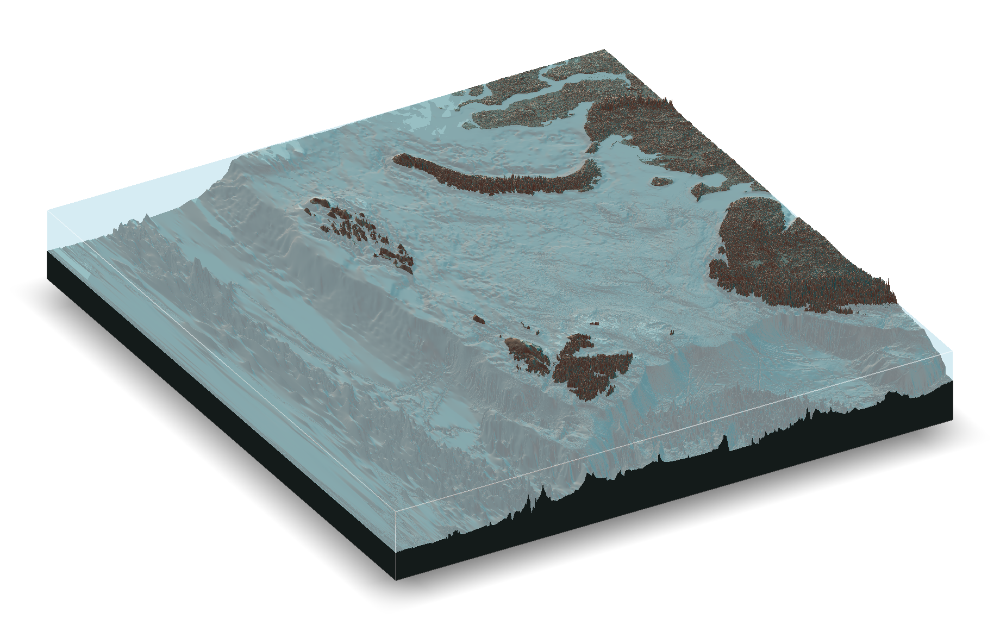

<!-- README.md is generated from README.Rmd. Please edit that file -->

```{r, include = FALSE}
knitr::opts_chunk$set(
  collapse = TRUE,
  comment = "#>",
  fig.path = "man/figures/README-",
  out.width = "100%"
)
```



Code to process raw data from the East Greenland Shelf for StrathE2E Polar


```{r, include = FALSE}
knitr::opts_chunk$set(
  collapse = TRUE,
  comment = "#>"
)
library(tidyverse) 
library(visNetwork)

```

This page details at a broad level the code written to extract data and parameterise StrathE2E*Polar* as part of MiMeMo. You can find information on the depedencies, runtimes, and tasks performed by each of the scripts. Scripts are loosely classified into families - *bathymetry* - *fish* - *flows* - *NM* - *Sediment* - *StrathE2E*. These can all be run from a master script, with a region file allowing the user to define the model domain for data extraction.

## Script dependencies

The widget below illustrates the hierarchy for MiMeMo scripts. It's interactive, so feel free to zoom in, drag the view, and highlight a script by clicking on a node. You can also move the nodes. When a script is highlighted, so are others within 1 degree of separation (scripts immediately upstream and downstream in the pipeline). You can also highlight a specific script from the drop down menu. Nodes are colour coded by family, and layers in the hierarchy indicate how many scripts must be run in advance. The network is created programmaticaly by looking for objects across all scripts present in both a `saveRDS` and `readRDS` call. 

```{r code relations, echo = FALSE, eval = TRUE, warning= FALSE}

network <- readRDS("../Objects/network.rds")

#### Build network widget ####

#v <-viridis::viridis(length(unique(network[[2]]$group)))                                # get viridis colours for each group
#v <-RColorBrewer::brewer.pal(length(unique(network[[2]]$group)), "Dark2")     # get viridis colours for each group
v <-palettetown::ichooseyou("charizard", length(unique(network[[2]]$group)))                             # get viridis colours for each group

visNetwork(network[[2]], network[[1]], width = "100%", height = "800") %>% # Build the network
  visHierarchicalLayout(direction = "UD") %>%                               # Use hierarchical layout from top to bottom
  visLegend(width = 0.15, ncol = 1, zoom = FALSE) %>%                        # Add a legend
  visOptions(highlightNearest = list(enabled = TRUE, labelOnly = FALSE),    # Control highlighting when selecting script
             nodesIdSelection = TRUE, clickToUse = TRUE, selectedBy = "group") %>% # Add drop down menu to highlight scripts
  
  ## Control colouring and highlighting per group
  
  visGroups(groupname = "atmosphere", shape = "dot", color = list(background = v[1], border = v[1],
                                              highlight = list(background = "white", border = v[1]))) %>% 
  visGroups(groupname = "bathymetry", shape = "dot", color = list(background = v[2], border = v[2], 
                                              highlight = list(background = "white", border = v[2]))) %>%
  visGroups(groupname = "detritus", shape = "dot",color = list(background = v[3], border = v[3],
                                              highlight = list(background = "white", border = v[3]))) %>% 
  visGroups(groupname = "fish", shape = "dot",color = list(background = v[4], border = v[4],
                                              highlight = list(background = "white", border = v[4]))) %>% 
  visGroups(groupname = "flows", shape = "dot", color = list(background = v[5], border = v[5],
                                              highlight = list(background = "white", border = v[5]))) %>% 
  visGroups(groupname = "NM", shape = "dot", color = list(background = v[6], border = v[6],
                                              highlight = list(background = "white", border = v[6]))) %>% 
  visGroups(groupname = "sediment", shape = "dot", color = list(background = v[7], border = v[7],
                                              highlight = list(background = "white", border = v[7]))) %>% 
  visGroups(groupname = "spm", shape = "dot", color = list(background = v[8], border = v[8],
                                              highlight = list(background = "white", border = v[8]))) %>% 
  visGroups(groupname = "strathE2E", shape = "dot", color = list(background = v[9], border = v[9],
                                              highlight = list(background = "white", border = v[9]))) %>% 
  visGroups(groupname = "targets", shape = "dot", color = list(background = v[10], border = v[10],
                                              highlight = list(background = "white", border = v[10])))

```  

## Run Times

```{r code runtimes, echo = FALSE, eval = TRUE, warning= FALSE, out.width ="100%", gif.asp = 1, dpi = 800}

timings <- readRDS("../Objects/Run time.rds")

#### Cool circular bar plot ####

#Create dataset
data <- data.frame(
  individual= timings$Script,
  group= timings$Type,
  value= timings$Minutes) %>% 
  separate(individual, into = c(NA, "individual",NA), sep = "[.]") # Drop leading script family for labelling bars.


# Set a number of 'empty bar' to add at the end of each group
empty_bar <- 3
to_add <- data.frame( matrix(NA, empty_bar*nlevels(data$group), ncol(data)) )
colnames(to_add) <- colnames(data)
to_add$group <- rep(levels(data$group), each=empty_bar)
data <- rbind(data, to_add)
data <- data %>% arrange(group)
data$id <- seq(1, nrow(data))

# Get the name and the y position of each label
label_data <- data
number_of_bar <- nrow(label_data)
angle <- 90 - 360 * (label_data$id-0.5) /number_of_bar     # I substract 0.5 because the letter must have the angle of the center of the bars. Not extreme right(1) or extreme left (0)
label_data$hjust <- ifelse( angle < -90, 1, 0)
label_data$angle <- ifelse(angle < -90, angle+180, angle)

# prepare a data frame for base lines
base_data <- data %>% 
  group_by(group) %>% 
  summarize(start=min(id), end=max(id) - empty_bar) %>% 
  rowwise() %>% 
  mutate(title=mean(c(start, end)))

# Make the plot
ggplot(data, aes(x=as.factor(id), y=value, fill=group)) +       # Note that id is a factor. If x is numeric, there is some space between the first bar
  
  geom_bar(aes(x=as.factor(id), y=value, fill=group), stat="identity", alpha=0.5) +   # Begin plot
  # Add axis marks
  annotate("rect", xmin = 0.5, ymin = 0, xmax = max(data$id) - 0.5, ymax = 60, colour = "white", alpha=0.1, fill = "cornflowerblue") +
  annotate("rect", xmin = 0.5, ymin = 60, xmax = max(data$id) - 0.5, ymax = 120, colour = "white", alpha=0) +
  annotate("rect", xmin = 0.5, ymin = 120, xmax = max(data$id) - 0.5, ymax = 180, colour = "white", alpha=0.1, fill = "cornflowerblue") +
  annotate("rect", xmin = 0.5, ymin = 180, xmax = max(data$id) - 0.5, ymax = 240, colour = "white", alpha=0) +
  annotate("rect", xmin = 0.5, ymin = 240, xmax = max(data$id) - 0.5, ymax = 300, colour = "white", alpha=0.1, fill = "cornflowerblue") +
  # Add text labels for axis marks
  annotate("text", x = rep(max(data$id),6), y = c(0, 60, 120, 180, 240, 300), label = c("0", "1", "2", "3", "4", "5") , color="grey", size=3 , angle=0, fontface="bold", hjust= 0.5) +
  geom_bar(aes(x=as.factor(id), y=value, fill=group), stat="identity") +
  #viridis::scale_fill_viridis(discrete = T, name = NULL) +
  palettetown::scale_fill_poke(pokemon = "Charizard", name = NULL) +
  ylim(-300,400) +        # More - creates more space in the centre, if a bar is larger than max it won't display
  annotate("text", x = max(data$id), y = 350, label = paste0("Total project run time: ", round(sum(data$value, na.rm = T)/60, digits = 2), " hours"),
           size = 3) +
  theme_minimal() +
  theme(legend.position = c(0.5, 0.5),
        axis.text = element_blank(),
        axis.title = element_blank(),
        panel.grid = element_blank(),
        plot.margin = unit(c(-1.8, -2.5,-2.5,-2.5), "cm")
       ) +
  coord_polar() + 
  geom_text(data=label_data, aes(x=id, y=value+10, label=individual, hjust=hjust), color="black", fontface="bold",alpha=0.6, size=2.5, angle= label_data$angle, inherit.aes = FALSE ) +
  # Add base line information
  geom_segment(data=base_data, aes(x = start, y = -5, xend = end, yend = -5), colour = "black", alpha=0.8, size=0.6 , inherit.aes = FALSE )  +
 # labs(caption = paste0("Total project run time: ", round(sum(data$value, na.rm = T)/60, digits = 2), " hours")) +
  NULL


```

## Script Objectives {.tabset}

In the future I plan to detail blow by blow what exactly each script does. This will likely take the form of a dropdown list of vignettes on this website. As there are about 40 scripts at the moment this isn't going to happen immediately. For now this section is here to briefly mention the purpose of each script.
 
### bathymetry

* bathymetry.1 DATA WRANGLING
* bathymetry.2 PLOTTING
* bathymetry.3 RAYSHADER
* bathymetry.4 DOMAIN CHOICES
* bathymetry.5 DEFINE DOMAIN

### fish

* fish.1 FAO REGIONS
* ices SUMMARIES AND PLOTTING
* gfw.1 DATA WRANGLING
* gfw.2 PLOTTING

### flows

* flows.1 VC-EXTRACTION
* flows.2 MAKE TRANSECTS
* flows.3 LABEL TRANSECTS
* flows.4 SAMPLE PERIMETER
* flows.5 SAMPLE FLUXES
* flows.6 VOLUME CHECK
* flows.7 PLOT EXCHANGES

### NM

* NM.1 GRID
* NM.2 EXTRACTION
* NM.3 SPATIAL
* NM.4 TIME SERIES
* NM.5 PLOTTING
* NM.6 LIGHT AND TEMP

### Sediment

* sediment.1 GRID
* sediment.2 RANDOM FOREST

### StrathE2E

* strathE2E.2 COMPILE DRIVING DATA
* strathE2E.3 COMPILE PHYSICAL PARAMETERS
